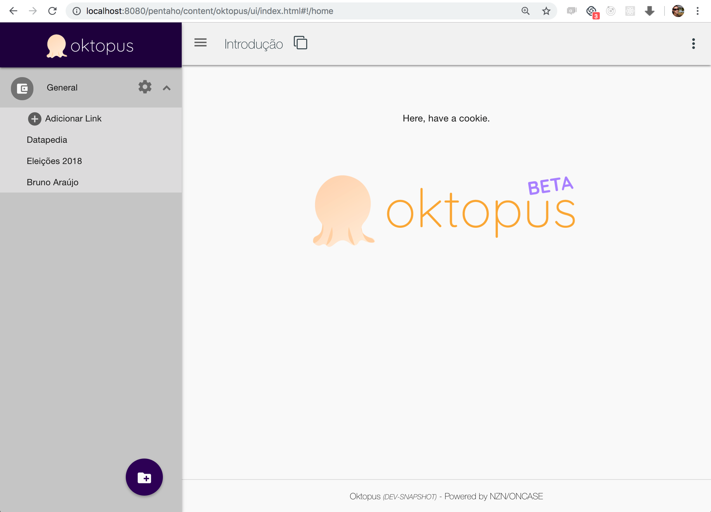
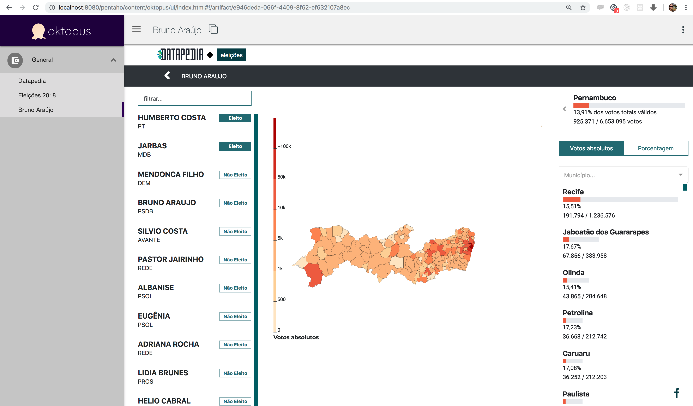
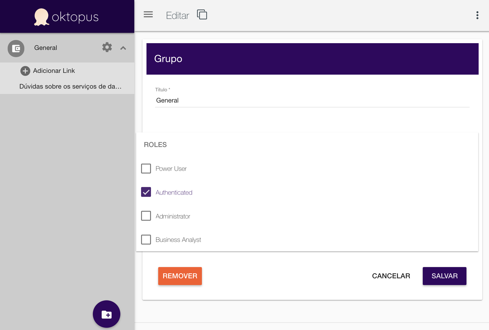

# Oktopus Pentaho

Oktopus is a way to keep track of links (dashboards, reports, content) and delegate access by Roles.

> Note: This is a legacy version of oktopus meant to be deployed on Pentaho as a plugin.
>
> The sole purpose of this repository is to centralize the development for ongoing projects using our Product Oktopus. 

Please visit https://oktopusapp.com.

# Install

* This plugin is being maintained for Pentaho 8.1+

```bash
cd pentaho-solutions/system
git clone https://github.com/oncase/oktopus-pentaho oktopus
cd ui
npm install
```

# Docker deploy

So far you'd need to `npm install` before building and spinning up a container. Here are the instructions:

```bash
cd ui
npm install
cd ..
docker build -t oktopus/oktopus-pentaho:dev .
docker-compose up -d
```
You must observe what's inside of your `.env` file. That will tell docker-compose which image to start on the `docker-compose up` command.

# Usage

URL: `http://localhost:8080/pentaho/content/oktopus/ui/index.html`









Some features:

* Edit/view mode - you can enable/disable editing mode
* Add/modify Groups - you can organize links into groups (folders)
* Delegate access - as an admin, you can choose which user roles will be able to see each group of links;
* Toggle left menu - you can hide the left menu to get more horizontal space for your reports;
* Listing of Pentaho content - you can choose any folder from `/public` to list its content into a Oktopus folder;

